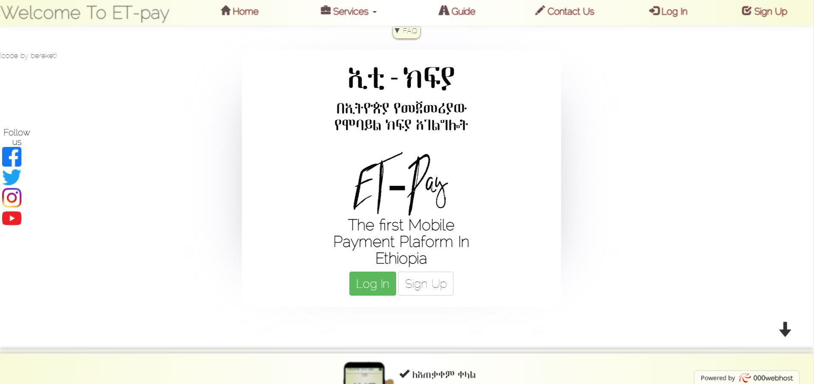
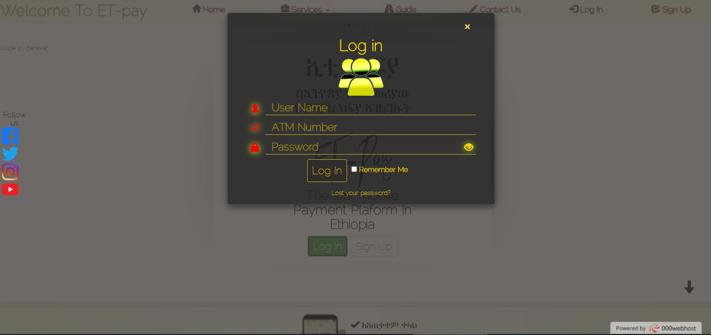
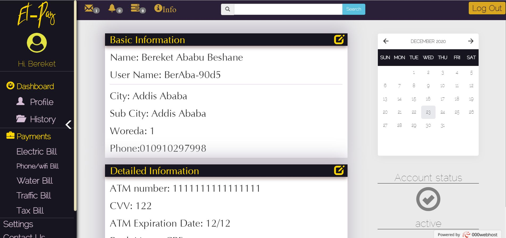
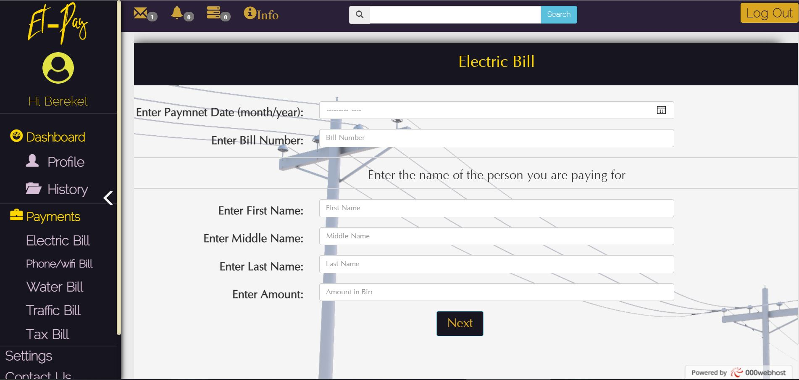
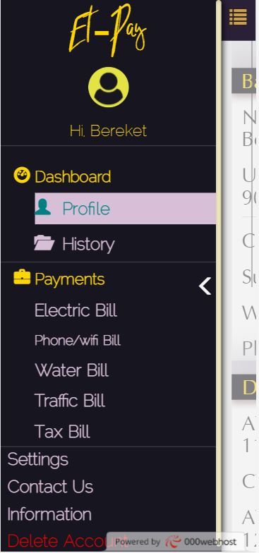

# Et-pay website with PHP

> payment website made with PHP and MVC pattern with full authentication and session handling. 

# Built With
- PHP 
- javascript 
- Jquery 
- Bootstrap 
- MySQL 
- HTML 
- CSS 

# Live demo 
- [click here](https://et-pay.000webhostapp.com/)

# Features
- Well built UI
- PHP emailer for verification
- PHP Argon2I algorithm for hashing passwords 
- MVC pattern 
- PDO PHP Document Object plus  Database Access Abstraction Layer

# screenshots

## Author

👤 **Bereket Beshane**

- Github: [@Berabjesus](https://github.com/Berabjesus)
- Twitter: [@bereket_ababu_b](https://twitter.com/bereket_ababu_b)
- Linkedin: Linkedin: [linkedin](https://www.linkedin.com/in/bereket-beshane-a1b75a1a9/) 

## 🤝 Contributing

Contributions, issues and feature requests are welcome!

## Show your support

Give a ⭐️ if you like this project!

## 📝 License

This project is [MIT](lic.url) licensed.

